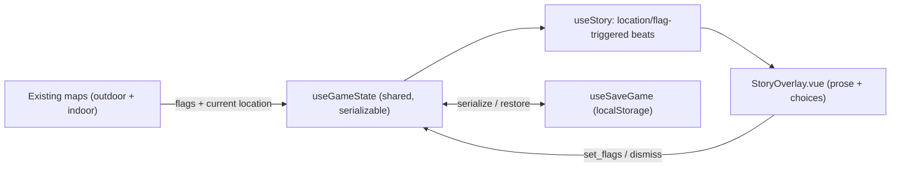

# Get Part I to Alpha — A Playable Day-1 Vertical Slice

**Status:** Draft plan  
**Scope:** Thin vertical slice — Day 1 narrative through shelter (food/water/sleep)  
**Persistence:** localStorage now; Neon Postgres + thin API as fast follow

## Overview

Wire the opening Day-1 narrative (woods → gate → compound → shelter with food/water) into the existing hex/grid map app by adding a minimal story engine and a localStorage save/load layer, then refresh the stale design docs. A Neon Postgres + thin API layer follows as a fast follow.

## Context: what already exists vs. what's missing

The docs say "no code yet," but [web/](../../web/) is a real Vue 3 + Vite app with working map tech and most Day-2 mechanics already built:

- Hex outdoor travel ([web/src/composables/useOutdoorWorld.js](../../web/src/composables/useOutdoorWorld.js), [web/content/world/map.yaml](../../web/content/world/map.yaml)) — the opening journey `trailhead → east-pines → center-pines → north-bend → gate-woods → utility-yard` exists, including the locked **gate puzzle** hex and the **building-entrance** hook.
- Grid indoor station ([web/src/composables/useIndoorBuilding.js](../../web/src/composables/useIndoorBuilding.js), [web/content/world/utility-station.yaml](../../web/content/world/utility-station.yaml)) — rooms, locked doors + keys, two floors, the full hydro-startup action chain.
- HUD: inventory, pickups, room/riverside actions, door controls.

What's missing for a playable Part I slice:

- **No story/narrative layer.** The prose in [design/content/story/part-i.md](../../design/content/story/part-i.md) is not in the game; there is no passage renderer despite the [story-data-format.md](../../design/content/story/story-data-format.md) spec.
- **No persistence.** State lives in-memory across composables; Reset wipes it. No save/load.
- **Stale docs** ([CLAUDE.md](../../CLAUDE.md), [docs/project-structure.md](../project-structure.md), [docs/next-steps-plan.md](../next-steps-plan.md)) claim design-only / pre-implementation.

## Slice goal (small + shippable)

Day 1 only, from [part-i.md](../../design/content/story/part-i.md): lost in the woods → slip through the gate → down to the compound → break into the garage → upstairs to the kitchen for **life-saving food and clean water** → settle into the library and sleep (end of Day 1). It exercises hex travel + indoor grid + narrative + save in one loop. The existing hydro startup, e-Buggy, and elevator beats stay out of this slice (they iterate next).

## Integration model

The slice is mostly linear, so the story engine surfaces a beat when its trigger (a flag or a `location: <hex|room id>`) becomes true, shows prose + choices in an overlay, and choices can `set_flags`. This is a minimal, spec-aligned subset of [story-data-format.md](../../design/content/story/story-data-format.md) (text, choices, require, set_flags, plus a `when` trigger); the full passage-graph interpreter with `go_to` and simulation gates is a later step.

## Work

### 1. Shared serializable game state + save/load

- Add `web/src/composables/useGameState.js` as the single source of truth the save layer reads/writes: story flags, inventory, current outdoor hex + discovered, current indoor room + door states + completed actions, current story beat. Wire existing `outdoor`/`indoor` composables to read flags/inventory from it (today flags live inside `useIndoorBuilding`).
- Add `web/src/composables/useSaveGame.js`: `save(slot)`, `load(slot)`, `hasSave()`, `clear()` against `localStorage` (JSON). Keep the serialization shape matching [story-data-format.md](../../design/content/story/story-data-format.md) State Model so it ports cleanly to the DB later.
- Add Save / Continue / Reset controls to [web/src/components/AppHeader.vue](../../web/src/components/AppHeader.vue) and auto-load last save on boot.

### 2. Minimal story engine

- Add `web/src/composables/useStory.js`: load `part-i.yaml`, watch shared flags + current location, expose the active beat and a `choose(choiceIdx)` that applies `set_flags` / advances.
- Add `web/src/components/story/StoryOverlay.vue`: renders the active beat's prose + choice buttons over either scene; mount it in [web/src/App.vue](../../web/src/App.vue).

### 3. Author the Day-1 beats

- Add `web/content/story/part-i.yaml` with beats keyed to existing map events:
  - `intro` (at `trailhead`) — Zanzibar lost, low on food/water; brief inventory intro.
  - `the-gate` (at `gate-woods`) — chain looks locked but is unattached; choice to slip through.
  - `the-compound` (at `utility-yard`) — the building + industrial garage.
  - `the-garage` (on building entry) — covered buggy, tools, locked interior doors.
  - `food-and-water` (kitchen) — the milestone beat.
  - `day-1-complete` (library) — sink into the chair, sleep; slice-end card.

### 4. Shelter actions for the food/water/sleep beats

- In [web/content/world/utility-station.yaml](../../web/content/world/utility-station.yaml) add `actions`: eat rations + purify water in `kitchen` (set `day1.found-food`, `day1.found-water`), and rest in `library` (set `day1.complete`). These reuse the existing action/flag plumbing in [web/src/composables/indoor/useIndoorActions.js](../../web/src/composables/indoor/useIndoorActions.js).

### 5. End-of-slice card

- A simple "Day 1 complete — to be continued" overlay when `day1.complete` is set, with a button back to the title/continue. Confirms a clean play loop for devs.

### 6. Refresh stale docs

- [CLAUDE.md](../../CLAUDE.md): remove "No code yet"; document the `web/` app (maps, story engine, save layer) and current phase.
- [docs/project-structure.md](../project-structure.md): add the real `web/` layout (`src/components`, `composables`, `views`, `content/world`, `content/story`).
- [docs/next-steps-plan.md](../next-steps-plan.md): mark scaffold + map tech + story format as done; set near-term = this slice + persistence.

## Fast follow (separate milestone, not part of this slice): Neon Postgres + thin API

- Schema in Neon: `players(id, …)` and `game_saves(player_id, slot, state jsonb, updated_at)` — `state` is the same JSON the localStorage layer already produces.
- Thin API as Vercel serverless functions (the app already uses `@vercel/analytics`): `GET/PUT /api/save`, anonymous `player_id` issued/stored client-side (full auth deferred).
- Swap `useSaveGame` storage adapter from localStorage to the API; keep localStorage as offline fallback.

## Notes / decisions

- `vue-router` is installed but unused; the overlay needs no routing, so the slice keeps App.vue's `place` toggle and does not introduce routes.
- Builder tools ship in the same bundle — fine for a dev alpha; gating them behind a flag/route is a later cleanup.
- Full passage-graph engine (`go_to`, `simulation:` gates) and the hydro/e-Buggy/elevator narrative are deliberately deferred to the next iteration.

## Tasks

- [ ] Add `useGameState.js` shared serializable store (flags, inventory, outdoor/indoor location + door/action state, current beat) and route existing composables through it
- [ ] Add `useSaveGame.js` (localStorage save/load/continue) and Save/Continue/Reset controls in AppHeader.vue with auto-load on boot
- [ ] Add `useStory.js` (location/flag-triggered beats) and StoryOverlay.vue, mounted in App.vue
- [ ] Author `web/content/story/part-i.yaml` Day-1 beats: intro, the-gate, the-compound, the-garage, food-and-water, day-1-complete
- [ ] Add kitchen (eat/purify) and library (rest) actions to utility-station.yaml setting `day1.found-food` / `day1.found-water` / `day1.complete`
- [ ] Add Day-1-complete end-of-slice overlay with continue/title button
- [ ] Update CLAUDE.md, docs/project-structure.md, docs/next-steps-plan.md to reflect the web/ app and the slice plan
- [ ] Fast follow: Neon Postgres schema + Vercel serverless save API + swap useSaveGame adapter (anonymous player id)
