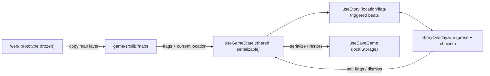

# Get Part I to Alpha — A Playable Day-1 Vertical Slice

**Status:** Draft plan  
**Scope:** Thin vertical slice — Day 1 narrative through shelter (food/water/sleep)  
**Persistence:** localStorage now; Neon Postgres + thin API as fast follow

## Overview

Build a new **`game/`** app alongside the frozen **`web/`** map prototype. Copy map features from the prototype into `game/`, add a minimal story engine and localStorage save/load, and wire the Day-1 narrative from [part-i.md](../../design/content/story/part-i.md). The prototype stays untouched so it can continue to serve as a standalone demo of hex/grid map tech.

## Prototype vs. game

```
atomic-adventures/
├── web/                 ← FROZEN — "Hex Map Prototype" demo (do not modify)
├── game/                ← NEW — vertical slice and full game grow here
├── packages/            ← OPTIONAL later — shared map engine when duplication hurts
│   └── map-engine/
├── design/
└── docs/plans/
```

| App | Purpose | Deploy target (example) |
| --- | ------- | ----------------------- |
| `web/` | Map tech demo for stakeholders — hex travel, grid interior, builder tools, hydro mechanics | `prototype.example.com` or `/prototype` |
| `game/` | Playable vertical slice → full game — story, save/load, normal play only | Main app URL |

**Rule:** No game features, story engine, or save/load in `web/`. Treat it as a read-only reference and demo.

### Leveraging the prototype without modifying it

**Phase 1 — copy-in (this slice):**

1. Scaffold `game/` as a new Vue 3 + Vite app (same stack as `web/`).
2. **Copy** (not move) the map layer from `web/src` into `game/src/lib/maps/` — composables, components, HUD panels. Omit builder tools (see below).
3. Copy world YAML from `web/content/world/` into `game/content/world/`. The game copy can evolve for story triggers; the prototype's maps stay frozen.
4. Add game-only layers in `game/`: `useGameState`, `useSaveGame`, `useStory`, `StoryOverlay`, and `game/content/story/part-i.yaml`.

**Phase 2 — extract shared package (when duplication hurts):**

- Move shared map code to `packages/map-engine/`.
- `game/` imports the package; `web/` stays self-contained (no requirement to migrate the prototype).

### What to copy vs. leave in the prototype

| From prototype | Into `game/` | Leave in `web/` only |
| --- | --- | --- |
| Hex/grid map composables & components | Yes | — |
| HUD panels (inventory, doors, actions, travel) | Yes | — |
| World YAML (`map.yaml`, `utility-station.yaml`) | Copy as starting point | Original stays frozen |
| `useFlags`, `useInventory` | Copy; extend via `useGameState` | Prototype's in-memory-only version |
| Hydro action chain in YAML | Copy (needed for later slices) | Prototype demo of mechanics |
| Builder tools (`*Builder*`, edit handles, builder sidebar) | **No — fast follow** | Yes — great for map authoring demo |
| `App.vue` wiring | Rewrite — title screen, story overlay, save/load | Prototype's outdoor/indoor toggle + builder checkbox |

### Builder mode

Normal gameplay **does not include builder mode**. The first pass ships without any builder UI or edit handles. Map authoring remains available in the frozen `web/` prototype. A builder layer or dev-only view in `game/` is a **fast follow** after basic gameplay works.

### Content strategy

- **`web/content/world/`** — frozen snapshot of the map at prototype time.
- **`game/content/world/`** — game copy; add story hooks and Day-1 shelter actions without affecting the demo.
- **`game/content/story/`** — narrative beats for Part I.

World maps and Part I prose are largely ready; the slice should need only minor YAML adjustments (shelter actions, story trigger flags).

### Running both apps

Root `package.json` workspaces (to add when scaffolding `game/`):

```json
{
  "workspaces": ["web", "game", "packages/*"],
  "scripts": {
    "dev:prototype": "npm run dev -w web",
    "dev:game": "npm run dev -w game"
  }
}
```

## Context: what already exists vs. what's missing

[web/](../../web/) is a Vue 3 + Vite **prototype** with working map tech and most Day-2 mechanics already built:

- Hex outdoor travel ([web/src/composables/useOutdoorWorld.js](../../web/src/composables/useOutdoorWorld.js), [web/content/world/map.yaml](../../web/content/world/map.yaml)) — the opening journey `trailhead → east-pines → center-pines → north-bend → gate-woods → utility-yard` exists, including the locked **gate puzzle** hex and the **building-entrance** hook.
- Grid indoor station ([web/src/composables/useIndoorBuilding.js](../../web/src/composables/useIndoorBuilding.js), [web/content/world/utility-station.yaml](../../web/content/world/utility-station.yaml)) — rooms, locked doors + keys, two floors, the full hydro-startup action chain.
- HUD: inventory, pickups, room/riverside actions, door controls.

What's missing for a playable Part I slice:

- **No `game/` app** — gameplay, story, and persistence belong in a new app, not in the prototype.
- **No story/narrative layer.** The prose in [part-i.md](../../design/content/story/part-i.md) is not in the game; there is no passage renderer despite the [story-data-format.md](../../design/content/story/story-data-format.md) spec.
- **No persistence.** Prototype state is in-memory only; Reset wipes it. No save/load.
- **Stale docs** ([CLAUDE.md](../../CLAUDE.md), [docs/project-structure.md](../project-structure.md), [docs/next-steps-plan.md](../next-steps-plan.md)) claim design-only / pre-implementation.

## Slice goal (small + shippable)

Day 1 only, from [part-i.md](../../design/content/story/part-i.md): lost in the woods → slip through the gate → down to the compound → break into the garage → upstairs to the kitchen for **life-saving food and clean water** → settle into the library and sleep (end of Day 1). It exercises hex travel + indoor grid + narrative + save in one loop. The existing hydro startup, e-Buggy, and elevator beats stay out of this slice (they iterate next).

## Integration model



The slice is mostly linear, so the story engine surfaces a beat when its trigger (a flag or a `location: <hex|room id>`) becomes true, shows prose + choices in an overlay, and choices can `set_flags`. This is a minimal, spec-aligned subset of [story-data-format.md](../../design/content/story/story-data-format.md) (text, choices, require, set_flags, plus a `when` trigger); the full passage-graph interpreter with `go_to` and simulation gates is a later step.

## Work

### 0. Scaffold `game/` and copy map layer from prototype

- Create `game/` as a Vue 3 + Vite app; add to root npm workspaces.
- Copy map composables, components, views, and HUD from `web/src` into `game/src/lib/maps/` (and `game/src/views/` as needed). **Exclude** all builder-related files (`*Builder*`, `MapEditHandlesLayer`, builder props editors, builder sidebar/panel).
- Copy `web/content/world/map.yaml` and `utility-station.yaml` into `game/content/world/`.
- Wire a slim `game/src/App.vue` — outdoor/indoor toggle only, no builder checkbox.

### 1. Shared serializable game state + save/load

- Add `game/src/composables/useGameState.js` as the single source of truth the save layer reads/writes: story flags, inventory, current outdoor hex + discovered, current indoor room + door states + completed actions, current story beat. Wire copied `outdoor`/`indoor` composables to read flags/inventory from it (today flags live inside `useIndoorBuilding` in the prototype).
- Add `game/src/composables/useSaveGame.js`: `save(slot)`, `load(slot)`, `hasSave()`, `clear()` against `localStorage` (JSON). Keep the serialization shape matching [story-data-format.md](../../design/content/story/story-data-format.md) State Model so it ports cleanly to the DB later.
- Add Save / Continue / Reset controls to `game/src/components/AppHeader.vue` and auto-load last save on boot.

### 2. Minimal story engine

- Add `game/src/composables/useStory.js`: load `part-i.yaml`, watch shared flags + current location, expose the active beat and a `choose(choiceIdx)` that applies `set_flags` / advances.
- Add `game/src/components/story/StoryOverlay.vue`: renders the active beat's prose + choice buttons over either scene; mount it in `game/src/App.vue`.

### 3. Author the Day-1 beats

- Add `game/content/story/part-i.yaml` with beats keyed to existing map events:
  - `intro` (at `trailhead`) — Zanzibar lost, low on food/water; brief inventory intro.
  - `the-gate` (at `gate-woods`) — chain looks locked but is unattached; choice to slip through.
  - `the-compound` (at `utility-yard`) — the building + industrial garage.
  - `the-garage` (on building entry) — covered buggy, tools, locked interior doors.
  - `food-and-water` (kitchen) — the milestone beat.
  - `day-1-complete` (library) — sink into the chair, sleep; slice-end card.

### 4. Shelter actions for the food/water/sleep beats

- In `game/content/world/utility-station.yaml` add `actions`: eat rations + purify water in `kitchen` (set `day1.found-food`, `day1.found-water`), and rest in `library` (set `day1.complete`). These reuse the existing action/flag plumbing copied from [web/src/composables/indoor/useIndoorActions.js](../../web/src/composables/indoor/useIndoorActions.js).

### 5. End-of-slice card

- A simple "Day 1 complete — to be continued" overlay when `day1.complete` is set, with a button back to the title/continue. Confirms a clean play loop for devs.

### 6. Refresh stale docs

- [CLAUDE.md](../../CLAUDE.md): document `web/` (frozen prototype) and `game/` (playable app); update project phase.
- [docs/project-structure.md](../project-structure.md): add `web/`, `game/`, and planned `packages/` layout.
- [docs/next-steps-plan.md](../next-steps-plan.md): mark scaffold + map prototype as done; set near-term = this slice + persistence.

## Fast follows (separate milestones, not part of this slice)

### Builder layer in `game/`

- Dev-only or gated builder view for map authoring inside the game app.
- Can copy builder components from `web/` when needed; prototype remains the primary map demo until then.

### Neon Postgres + thin API

- Schema in Neon: `players(id, …)` and `game_saves(player_id, slot, state jsonb, updated_at)` — `state` is the same JSON the localStorage layer already produces.
- Thin API as Vercel serverless functions: `GET/PUT /api/save`, anonymous `player_id` issued/stored client-side (full auth deferred).
- Swap `useSaveGame` storage adapter from localStorage to the API; keep localStorage as offline fallback.

### Shared map package

- Extract `packages/map-engine/` when maintaining duplicate map code in `web/` and `game/` becomes painful.
- `game/` imports the package; `web/` migration is optional.

## Notes / decisions

- **`web/` is frozen** for the duration of this slice — no edits except critical prototype bugfixes if absolutely necessary.
- **No builder mode** in the first pass; normal gameplay only.
- Map features and Part I storyline prose are largely ready — minimal YAML adjustments expected.
- Full passage-graph engine (`go_to`, `simulation:` gates) and the hydro/e-Buggy/elevator narrative are deliberately deferred to the next iteration.
- `vue-router` may be added to `game/` for a title screen; the prototype's simple `place` toggle is the model for outdoor/indoor switching within a session.

## Tasks

- [ ] Scaffold `game/` Vue 3 + Vite app; add root npm workspaces
- [ ] Copy map layer from `web/` into `game/src/lib/maps/` (exclude builder tools)
- [ ] Copy world YAML into `game/content/world/`
- [ ] Add `useGameState.js` shared serializable store and route copied composables through it
- [ ] Add `useSaveGame.js` (localStorage save/load/continue) and Save/Continue/Reset controls in AppHeader.vue with auto-load on boot
- [ ] Add `useStory.js` (location/flag-triggered beats) and StoryOverlay.vue, mounted in App.vue
- [ ] Author `game/content/story/part-i.yaml` Day-1 beats: intro, the-gate, the-compound, the-garage, food-and-water, day-1-complete
- [ ] Add kitchen (eat/purify) and library (rest) actions to `game/content/world/utility-station.yaml` setting `day1.found-food` / `day1.found-water` / `day1.complete`
- [ ] Add Day-1-complete end-of-slice overlay with continue/title button
- [ ] Update CLAUDE.md, docs/project-structure.md, docs/next-steps-plan.md to reflect `web/` + `game/` layout
- [ ] Fast follow: builder layer in `game/`
- [ ] Fast follow: Neon Postgres schema + Vercel serverless save API + swap useSaveGame adapter (anonymous player id)
- [ ] Fast follow: extract `packages/map-engine/` when duplication hurts
