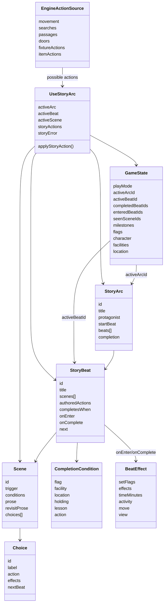

# Story Mode Technical Design

**Status:** Proposed target design
**Last updated:** 2026-07-07
**Primary follow-up plan:** [Story Mode Model Migration Plan](story-mode-migration-plan.md)
**Related contracts:** [Play Modes And Story Mode Control](../contracts/play-modes-and-story-mode.md), [Story Beats And Scenes](../contracts/story-beats.md)

## Goal

Condense Story mode into a smaller, clearer object model before more authored
story behavior is added.

The current implementation has the right ingredients, but the responsibility is
split across too many names and two reactive controllers. `useStoryline` owns
canonical progression, while `useStory` owns prose and choices. Both react to
movement, flags, clock, and mode. That split makes the player-facing story
moment feel unstable and makes the authoring model harder to explain.

The target model is:

- `StoryArc` is the major story problem and resolution.
- `StoryBeat` is the unit of story progression.
- `Scene` is the prose presentation for a beat under particular circumstances.
- Story actions, completion conditions, and effects are plain fields on the
  beat rather than separate policy concepts.

This is a controlled model collapse, not a full restart. Keep useful authored
content, selection criteria, effects, tests, and builder work where they still
serve the new vocabulary.

## Use Cases

The design is meant to support:

1. A stable guided Story mode where Zanzibar experiences the canonical Part I
   story from the inside.
2. A Part I survival arc that takes Zanzibar from being lost and in danger of
   death through satisfying basic needs: food, water, shelter, and power.
3. Story beats that can present different prose scenes depending on location,
   flags, time, prior scene visibility, and other circumstances.
4. Story actions that keep at least one plausible story-continuing path visible
   while ordinary physically valid movement remains available.
5. Explicit completion conditions for beat progression, without a general
   scripting language.
6. Enter and complete effects for time passage, flags, validated character or
   inventory effects, stage views, and rare forced movement.
7. Story Builder authoring with one primary story-progress object instead of
   separate "step" and "beat" concepts that refer to each other.
8. Open-world mode that can reuse scenes, world content, actions, and effects
   with fewer constraints.

## Object Model



The diagram is the composed runtime graph, not a requirement that Scenes be
physically nested inside the StoryArc JSON document. Canonical Scenes may
remain a top-level collection with independent revisions, location triggers,
and an optional StoryBeat association. Runtime composition resolves those
associations into `StoryBeat.scenes[]`.

## Object Purposes

### StoryArc

`StoryArc` replaces the current `Scenario`.

A story arc takes the protagonist through one major problem to its resolution.
The primary Part I arc is the survival arc: Zanzibar is lost, hungry, thirsty,
exposed, and without power; the arc resolves when he finds enough shelter,
food, water, and usable power to survive and continue.

`StoryArc` owns:

- stable arc ID;
- title or author-facing label;
- protagonist or point-of-view metadata when needed;
- `startBeat`;
- ordered or referenced `StoryBeat` entries.

The term `StoryArc` should be used in code, content, builder UI, tests, and
contracts after migration. Do not keep `Scenario` as a parallel concept.

### StoryBeat

`StoryBeat` replaces the current `Step`.

A story beat is what happens next in the authored story. It is the unit of
canonical story progression. The current `Step` concept was introduced to hold
the responsibilities that should have expanded the beat model: progression,
actions, completion, and effects.

`StoryBeat` owns:

- beat ID;
- title or author-facing label;
- scene variants;
- beat-wide story actions;
- completion condition;
- enter and complete effects;
- `next` beat; the arc completion node owns any cross-arc handoff and
  acknowledgement card.

The Story mode controller should point to one active beat. The player-facing
experience should not be an emergent result of one controller advancing a step
while another independently selects prose.

### Scene

`Scene` replaces the current `StoryBeat` prose object.

A scene is one contextual move within a beat: what Zanzibar experiences and
can choose here and now. A single story beat may contain one or more scenes as
the character moves through locations or circumstances without completing the
beat. Any given location may host many scenes belonging to different beats.

`Scene` owns:

- scene ID;
- trigger or event criteria;
- optional conditions such as mode, location match, time, milestone, or seen
  state;
- prose;
- revisit prose where useful.
- contextual authored choices.

The useful part of the current beat-selection system should move here. Scene
selection should become a pure helper used by the Story mode controller.

### Choice

A choice is an authored player-facing action attached to a scene.

Choices are most useful when they carry prose intent, such as "Follow the fence
uphill" or "Read the laminated card." A choice may:

- move the player through normal movement rules;
- open a stage view;
- set flags or apply validated effects;
- consume time;
- explicitly advance to a beat when that is cleaner than a location or flag
  completion condition.

Choices should not be the only way to move. Ordinary map movement remains
available when physically valid, unless a specific authored scene has a
concrete physical or narrative reason to restrict it.

Choices live on `Scene` because they express what the player can choose in the
specific situation presented by that scene. Changing location, time, flags, or
other scene-selection criteria may therefore change both prose and contextual
choices while the same StoryBeat remains active. Beat-wide authored actions
remain separate when an action should stay available throughout the beat.

### Authored Actions And Engine Actions

`authoredActions` replaces the current collection of policy buckets where
possible.

The useful idea is simple: what story-specific actions should the beat add,
enrich, or emphasize? The current `AllowedPolicy` separates
`storyForwardActions`, `optionalActions`, `indoorActions`, `outdoorActions`,
`itemActions`, `stageViews`, and movement buckets. That is accurate but
verbose.

Prefer one list of stable authored action references with a role:

```js
authoredActions: [
  { id: "move-hex:east-pines", kind: "move", label: "Move uphill along the fence", role: "story" },
  { id: "half-full-water-bottle.drink", kind: "item", role: "survival" },
  { id: "search:barrier", kind: "world", role: "optional" }
]
```

Suggested roles:

- `story`: plausible canonical story-continuing action;
- `optional`: known curiosity action that does not break discovery order;
- `survival`: food, water, rest, safety, or other wellbeing action;
- `utility`: status, inventory, or other non-mutating support action.

The UI does not need to visually label these roles by default. They exist so
the controller can sort, filter, and validate actions coherently.

Authored actions are not the full universe of what the player can try. The game
engine also supplies possible actions from the current physical state:

- neighboring hex movement;
- room, stand, and exterior-node movement;
- searching along a fence line for holes;
- crossing a discovered passage such as a fence opening or river ford;
- opening, closing, breaking, or toggling doors;
- fixture, item, inventory, status, and stage-view actions.

The engine remains the ultimate guard rail. No beat can let the player walk
through a fence, jump across the map, ignore a locked door, or bypass the
physical rules of the world. There is no magic in this world. Authored story
actions enrich the engine actions with context, labels, ordering, and story
intent; they do not override possibility.

`useStoryArc` should combine:

1. engine-provided possible actions;
2. active-scene choices and beat-authored actions;
3. current character, inventory, facility, and wellbeing state.

The result is the visible action set. For example, the map may allow a normal
click to a neighboring hex while the beat also offers a richer action such as
"Move uphill along the fence." Both can resolve through the same movement
guard rails.

### CompletionCondition

`CompletionCondition` replaces the current `CompletionPredicate` term.

The meaningful story question is: what proves this beat is done? Supported
conditions should stay typed and small:

- flag is set;
- facility state matches;
- player reaches a location;
- player or accessible holder has an item;
- lesson is complete;
- a meaningful milestone or state change produced by an action has happened.

Avoid a general boolean scripting language until a concrete authored sequence
requires it. A compact form is enough for most beats:

```js
completesWhen: { flag: "day1.complete" }
completesWhen: { location: { place: "indoors", room: "large-bay" } }
completesWhen: { facility: { "hydro.online": true } }
```

If multiple alternatives are needed, prefer an explicit small shape:

```js
completesWhen: {
  anyOf: [
    { flag: "day1.complete" },
    { location: { place: "indoors", room: "library" } }
  ]
}
```

Most actions are not story milestones and do not need durable action-history
tracking. A significant action should produce a meaningful state change, such
as setting a flag, completing a milestone, changing facility state, or
completing a story arc. For example, flipping the circuit breaker to on is an
action; its effect can bring power online, complete the current beat, and mark
the arc's resolution.

### BeatEffect

`BeatEffect` keeps the useful part of `StepEffect`, renamed for the new model.

Beat effects may run on entering or completing a beat:

- `setFlags`;
- validated character, inventory, quest, knowledge, or skill effects;
- `timeMinutes` and activity profile;
- rare forced movement;
- stage view opening.

Forced movement should stay rare. It is appropriate when Zanzibar has actually
committed to movement in prose or when a map transition/action has already been
chosen.

### GameState

Story mode save state should point to the active arc and beat:

```js
{
  playMode: "story",
  story: {
    activeArcId: "part-i-opener",
    activeBeatId: "lost-in-the-woods",
    completedBeatIds: [],
    enteredBeatIds: [],
    seenSceneIds: []
  },
  milestones: {}
}
```

The current `storyline` state should be migrated to `story`. Save state
preserves the player's current game state so the player can close the game,
return later, and continue from the same point. Milestone completion must also
be saved as part of game state. General action history is not needed at this
time.

## Controller Model

### useStoryArc

`useStoryArc` should replace the split between `useStoryline` and `useStory`
for Story mode.

It should own:

- active arc and active beat;
- selecting the active scene for that beat;
- combining engine-provided possible actions with active-scene choices and
  beat-authored actions;
- applying scene choices and story actions;
- applying beat enter and complete effects once;
- checking beat completion;
- advancing to the next beat or arc;
- reporting authoring/runtime errors.

It should expose one stable UI-facing story object:

```js
const {
  activeArc,
  activeBeat,
  activeScene,
  storyActions,
  applyStoryAction,
  storyError,
} = useStoryArc(...)
```

This controller should observe movement, flags, facilities, character state,
clock, and content updates, but one place should decide the current story
moment.

### Scene Selection Helper

The current `useStory` scene-selection rules are useful and should not be
thrown away blindly. Move them into a pure helper:

```js
selectSceneForBeat(beat, gameState, locationContext)
```

The helper should evaluate trigger, mode, beat, location match, time, milestone,
and seen-state criteria. It should not mutate game state, apply choices, or
advance progression.

### Open-World Controller

Open-world mode makes use of many story-mode elements, but with fewer
constraints. It can reuse scenes, world content, actions, effects, inventory,
character state, facilities, and stage views.

Open-world differences should live in a separate controller rather than inside
`useStoryArc`. For example, a future `useOpenWorldStory` can select ambient
scenes, expose broad actions, and avoid canonical beat progression. That means
getting Story mode working well is the first priority; open-world can then use
the same content pieces with looser rules.

## Simplifying The Current Policy Objects

### AllowedPolicy

Current meaning: authored permission and emphasis data for the active step.

Useful part: stable action references that say what the story wants to surface
or permit right now.

Target: collapse into `StoryBeat.authoredActions` combined with
engine-provided possible actions at runtime.

### ActionPolicy

Current meaning: runtime projection of `AllowedPolicy` used by UI builders to
answer "is this action allowed?"

Useful part: a runtime helper can still answer that question.

Target: do not keep `ActionPolicy` as a named model object. Prefer helper
functions such as:

```js
isActionAvailable(action, activeBeat, gameState)
visibleActionsFor(activeBeat, worldActions, gameState)
```

### CompletionPredicate

Current meaning: typed condition that advances the current step.

Useful part: story progression needs a typed completion condition.

Target: rename to `CompletionCondition`, simplify its shape, and keep it as a
field on `StoryBeat`.

## Authoring Model

Story Builder should present Story mode authoring as:

1. Choose a story arc.
2. Edit its ordered story beats.
3. For each beat, edit:
   - title;
   - its ordered scenes, including prose, criteria, and choices;
   - beat-wide authored actions;
   - completion condition;
   - enter and complete effects;
   - next beat or next arc.

World Builder and Content Builder should remain separate. They provide
referenced locations, rooms, exterior nodes, items, lessons, documents,
characters, and actions. Story Builder composes these references into arcs and
beats. Story Builder should allow authors to change the current story arcs and
beats directly. It does not need draft comparison or old-draft preservation
machinery.

## Example Shape

```js
{
  id: "part-i-opener",
  title: "Part I Opener",
  protagonist: "zanzibar-nuhero",
  startBeat: "lost-in-the-woods",
  beats: [
    {
      id: "find-shelter",
      title: "Find shelter before nightfall",
      scenes: [
        {
          id: "yard-after-gate",
          trigger: { place: "outdoors", hex: "utility-yard" },
          prose: "The road ends at a silent utility building. The windows are dark, but the walls cut the wind.",
          choices: [
            { id: "approach-building", label: "Approach the building", action: { kind: "move", exteriorNode: "large-bay-man-front" } }
          ]
        },
        {
          id: "large-bay-door",
          trigger: { place: "indoors", exteriorNode: "large-bay-man-front" },
          prose: "The side door gives a little under Zanzibar's shoulder. Not enough, but enough to make a plan."
        }
      ],
      authoredActions: [
        { id: "move-exterior:large-bay-man-front", kind: "move", role: "story" },
        { id: "door-break:large-bay-man", kind: "world", role: "story" },
        { id: "half-full-water-bottle.drink", kind: "item", role: "survival" }
      ],
      completesWhen: { location: { place: "indoors", room: "large-bay" } },
      next: "solve-first-crisis"
    }
  ]
}
```

## Decisions

1. Choices live on `Scene`. A scene is a contextual move within a StoryBeat;
   the beat remains the organizing unit for progression through an arc.
2. Authored actions are combined with engine-provided possible actions. The
   engine remains the final authority on physical possibility.
3. Significant actions should produce state changes or milestones. Most actions
   are ordinary events, not completion events. General action history is not
   needed now.
4. Save state preserves the player's current game state so the player can close
   the game and later continue from the same point. `story` replaces
   `storyline` as the story-mode save key.
5. The current authored arc is named "Part I Opener." Do not overfit the model
   to today's exact arc boundaries. Story Builder must support trying different
   arc shapes, such as one Day 1 arc, separate opener/station/power arcs, or a
   different split that plays better.
6. Story Builder should allow changes to story arcs. It does not need to
   preserve old drafts or compare arc-boundary experiments.
